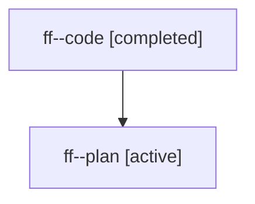

# Family: ff

Owner: `bbugyi200.athena` · Hood: `ff` · Members: 2

## Lineage

The diagram is an optional enhancement; the ordered table below contains the same lineage in accessible text.

| Role | Agent | State | Model / provider | Timing | Commits | Prompt | Chat |
|---|---|---|---|---|---:|---|---|
| code | ff--code | completed | gpt-5.6-sol / codex | 2026-07-19T21:26:49.567286+00:00 | 1 | — | [Chat](../agents/bbugyi200.athena.ff--code/chat.md) |
| plan | ff--plan | active | gpt-5.6-sol / codex | 2026-07-19T21:18:10.741782+00:00 | 0 | [Prompt](../agents/bbugyi200.athena.ff--plan/prompt.md) | [Chat](../agents/bbugyi200.athena.ff--plan/chat.md) |
