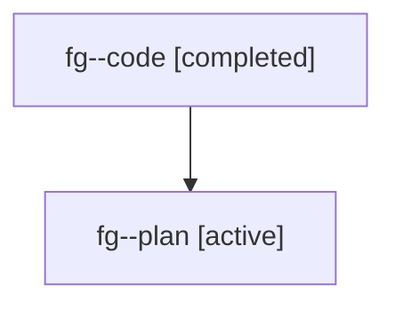

# Family: fg

[Agent Hoods](../README.md) / [bbugyi200](../users/bbugyi200/README.md) / [athena](../users/bbugyi200/machines/athena/README.md) / [fg](../users/bbugyi200/machines/athena/hoods/fg/README.md) / fg

Owner: `bbugyi200.athena` · Hood: `fg` · Members: 2

## Lineage

The diagram is an optional enhancement; the ordered table below contains the same lineage in accessible text.

| Role | Agent | State | Model / provider | Timing | Commits | Prompt | Chat |
|---|---|---|---|---|---:|---|---|
| code | fg--code | completed | gpt-5.6-sol / codex | 2026-07-19T21:26:56.164441+00:00 | [1](../agents/bbugyi200.athena.fg--code/README.md#commits) | — | [Chat](../agents/bbugyi200.athena.fg--code/chat.md) |
| plan | fg--plan | active | gpt-5.6-sol / codex | 2026-07-19T21:20:34.974275+00:00 | 0 | [Prompt](../agents/bbugyi200.athena.fg--plan/prompt.md) | [Chat](../agents/bbugyi200.athena.fg--plan/chat.md) |

## Commits

| Role | Commit | Subject | Committed (UTC) |
|---|---|---|---|
| code | [`99e062e`](https://github.com/sase-org/sase/commit/99e062ed21f26a61d682534cf6f44917d73bbc96) | feat(ace): navigate prompt searches across panes | 2026-07-19 21:46:40 |
