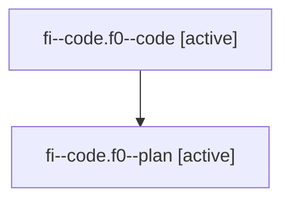

# Family: fi--code.f0

Owner: `bbugyi200.athena` · Hood: `fi` · Members: 2

## Lineage

The diagram is an optional enhancement; the ordered table below contains the same lineage in accessible text.

| Role | Agent | State | Model / provider | Timing | Commits | Prompt | Chat |
|---|---|---|---|---|---:|---|---|
| code | fi--code.f0--code | active | gpt-5.6-sol / codex | 2026-07-20T01:54:01.705015+00:00 | 0 | — | — |
| plan | fi--code.f0--plan | active | gpt-5.6-sol / codex | 2026-07-20T01:46:47.766632+00:00 | 0 | [Prompt](../agents/bbugyi200.athena.fi--code.f0--plan/prompt.md) | [Chat](../agents/bbugyi200.athena.fi--code.f0--plan/chat.md) |
