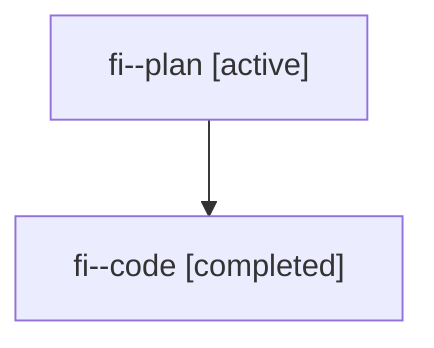

# Family: fi

[Agent Hoods](../README.md) / [bbugyi200](../users/bbugyi200/README.md) / [athena](../users/bbugyi200/machines/athena/README.md) / [fi](../users/bbugyi200/machines/athena/hoods/fi/README.md) / fi

Owner: `bbugyi200.athena` · Hood: `fi` · Members: 2

## Lineage

The diagram is an optional enhancement; the ordered table below contains the same lineage in accessible text.

| Role | Agent | State | Model / provider | Timing | Commits | Prompt | Chat |
|---|---|---|---|---|---:|---|---|
| plan | fi--plan | active | claude-fable-5 / claude | 2026-07-19T22:29:56.468396+00:00 | 0 | [Prompt](../agents/bbugyi200.athena.fi--plan/prompt.md) | [Chat](../agents/bbugyi200.athena.fi--plan/chat.md) |
| code | fi--code | completed | gpt-5.6-sol / codex | 2026-07-19T22:43:07.238735+00:00 | 0 | — | [Chat](../agents/bbugyi200.athena.fi--code/chat.md) |

## Commits

| Role | Repo | Commit | Subject | Committed |
|---|---|---|---|---|
| — | sase | [`aefb7a7`](https://github.com/sase-org/sase/commit/aefb7a7a3b3ae6cfb28d22025d39cccd5f4e38ca) | feat(ace): configure tribe panel displays | 2026-07-19 23:27:01 UTC |

## Neighbors

| Agent | Relation | State |
|---|---|---|
| [fi--code.f0](bbugyi200.athena.fi--code.f0.md) (family · 2) | descendant | active 2 |
| [fi.f0](../agents/bbugyi200.athena.fi.f0/README.md) | descendant | active |
| [fi.f1](../agents/bbugyi200.athena.fi.f1/README.md) | descendant | active |
