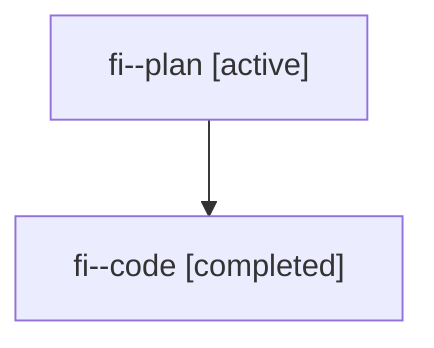

# Family: fi

Owner: `bbugyi200.athena` · Hood: `fi` · Members: 2

## Lineage

The diagram is an optional enhancement; the ordered table below contains the same lineage in accessible text.

| Role | Agent | State | Model / provider | Timing | Commits | Prompt | Chat |
|---|---|---|---|---|---:|---|---|
| plan | fi--plan | active | claude-fable-5 / claude | 2026-07-19T22:29:56.468396+00:00 | 0 | [Prompt](../agents/bbugyi200.athena.fi--plan/prompt.md) | [Chat](../agents/bbugyi200.athena.fi--plan/chat.md) |
| code | fi--code | completed | gpt-5.6-sol / codex | 2026-07-19T22:43:07.238735+00:00 | 0 | — | [Chat](../agents/bbugyi200.athena.fi--code/chat.md) |
