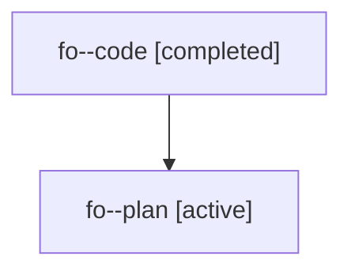

# Family: fo

[Agent Hoods](../README.md) / [bbugyi200](../users/bbugyi200/README.md) / [athena](../users/bbugyi200/machines/athena/README.md) / [fo](../users/bbugyi200/machines/athena/hoods/fo/README.md) / fo

Owner: `bbugyi200.athena` · Hood: `fo` · Members: 2

## Lineage

The diagram is an optional enhancement; the ordered table below contains the same lineage in accessible text.

| Role | Agent | State | Model / provider | Timing | Commits | Prompt | Chat |
|---|---|---|---|---|---:|---|---|
| code | fo--code | completed | gpt-5.6-sol / codex | 2026-07-20T01:14:06.585463+00:00 | [1](../agents/bbugyi200.athena.fo--code/README.md#commits) | — | [Chat](../agents/bbugyi200.athena.fo--code/chat.md) |
| plan | fo--plan | active | claude-fable-5 / claude | 2026-07-20T01:07:18.035858+00:00 | 0 | [Prompt](../agents/bbugyi200.athena.fo--plan/prompt.md) | [Chat](../agents/bbugyi200.athena.fo--plan/chat.md) |

## Commits

| Role | Repo | Commit | Subject | Committed (UTC) |
|---|---|---|---|---|
| code | sase | [`5b49b20`](https://github.com/sase-org/sase/commit/5b49b204f84e7933984a283373ec837aaa4bff71) | fix(axe): constrain refresh docs agents to documentation | 2026-07-20 01:23:04 |
