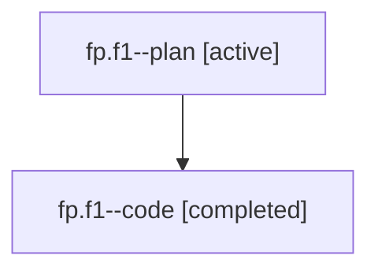

# Family: fp.f1

[Agent Hoods](../README.md) / [bbugyi200](../users/bbugyi200/README.md) / [athena](../users/bbugyi200/machines/athena/README.md) / [fp](../users/bbugyi200/machines/athena/hoods/fp/README.md) / fp.f1

Owner: `bbugyi200.athena` · Hood: `fp` · Members: 2

## Lineage

The diagram is an optional enhancement; the ordered table below contains the same lineage in accessible text.

| Role | Agent | State | Model / provider | Timing | Commits | Prompt | Chat |
|---|---|---|---|---|---:|---|---|
| plan | fp.f1--plan | active | gpt-5.6-sol / codex | 2026-07-20T11:36:50.864896+00:00 | 0 | [Prompt](../agents/bbugyi200.athena.fp.f1--plan/prompt.md) | [Chat](../agents/bbugyi200.athena.fp.f1--plan/chat.md) |
| code | fp.f1--code | completed | gpt-5.6-sol / codex | 2026-07-20T11:43:42.314543+00:00 | 0 | — | [Chat](../agents/bbugyi200.athena.fp.f1--code/chat.md) |

## Neighbors

| Agent | Relation | State |
|---|---|---|
| [fp](bbugyi200.athena.fp.md) (family · 2) | ancestor | active 1, completed 1 |
| [fp.f0](../agents/bbugyi200.athena.fp.f0/README.md) | fp hood | waiting |
