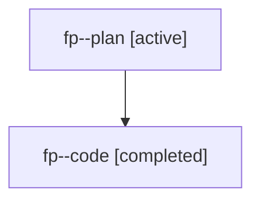

# Family: fp

[Agent Hoods](../README.md) / [bbugyi200](../users/bbugyi200/README.md) / [athena](../users/bbugyi200/machines/athena/README.md) / [fp](../users/bbugyi200/machines/athena/hoods/fp/README.md) / fp

Owner: `bbugyi200.athena` · Hood: `fp` · Members: 2

## Lineage

The diagram is an optional enhancement; the ordered table below contains the same lineage in accessible text.

| Role | Agent | State | Model / provider | Timing | Commits | Prompt | Chat |
|---|---|---|---|---|---:|---|---|
| plan | fp--plan | active | gpt-5.6-sol / codex | 2026-07-20T01:17:06.114687+00:00 | 0 | [Prompt](../agents/bbugyi200.athena.fp--plan/prompt.md) | [Chat](../agents/bbugyi200.athena.fp--plan/chat.md) |
| code | fp--code | completed | gpt-5.6-sol / codex | 2026-07-20T01:32:46.694210+00:00 | [1](../agents/bbugyi200.athena.fp--code/README.md#commits) | — | [Chat](../agents/bbugyi200.athena.fp--code/chat.md) |

## Commits

| Role | Repo | Commit | Subject | Committed |
|---|---|---|---|---|
| code | sase | [`8256e25`](https://github.com/sase-org/sase/commit/8256e2584648cf54e62f0cf8cf04ae73ee322d7d) | fix(agents): preserve clan tribe across filtered snapshots | 2026-07-19 22:13:07 EDT |

## Neighbors

| Agent | Relation | State |
|---|---|---|
| [fp.f0](../agents/bbugyi200.athena.fp.f0/README.md) | descendant | waiting |
| [fp.f1](bbugyi200.athena.fp.f1.md) (family · 2) | descendant | active 1, completed 1 |
