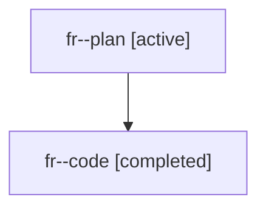

# Family: fr

[Agent Hoods](../README.md) / [bbugyi200](../users/bbugyi200/README.md) / [athena](../users/bbugyi200/machines/athena/README.md) / [fr](../users/bbugyi200/machines/athena/hoods/fr/README.md) / fr

Owner: `bbugyi200.athena` · Hood: `fr` · Members: 2

## Lineage

The diagram is an optional enhancement; the ordered table below contains the same lineage in accessible text.

| Role | Agent | State | Model / provider | Timing | Commits | Prompt | Chat |
|---|---|---|---|---|---:|---|---|
| plan | fr--plan | active | gpt-5.6-sol / codex | 2026-07-20T01:47:52.665008+00:00 | 0 | [Prompt](../agents/bbugyi200.athena.fr--plan/prompt.md) | [Chat](../agents/bbugyi200.athena.fr--plan/chat.md) |
| code | fr--code | completed | gpt-5.6-sol / codex | 2026-07-20T01:53:46.745820+00:00 | [1](../agents/bbugyi200.athena.fr--code/README.md#commits) | — | [Chat](../agents/bbugyi200.athena.fr--code/chat.md) |

## Commits

| Role | Repo | Commit | Subject | Committed (UTC) |
|---|---|---|---|---|
| code | sase | [`1c2e197`](https://github.com/sase-org/sase/commit/1c2e197d34e8bf6f0e1462026e9611cfeade3c0c) | fix: resolve family forks from member transcripts | 2026-07-20 02:05:06 |
