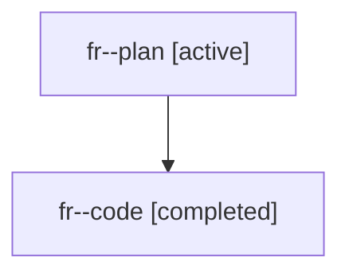

# Family: fr

Owner: `bbugyi200.athena` · Hood: `fr` · Members: 2

## Lineage

The diagram is an optional enhancement; the ordered table below contains the same lineage in accessible text.

| Role | Agent | State | Model / provider | Timing | Commits | Prompt | Chat |
|---|---|---|---|---|---:|---|---|
| plan | fr--plan | active | gpt-5.6-sol / codex | 2026-07-20T01:47:52.665008+00:00 | 0 | [Prompt](../agents/bbugyi200.athena.fr--plan/prompt.md) | [Chat](../agents/bbugyi200.athena.fr--plan/chat.md) |
| code | fr--code | completed | gpt-5.6-sol / codex | 2026-07-20T01:53:46.745820+00:00 | 1 | — | [Chat](../agents/bbugyi200.athena.fr--code/chat.md) |
