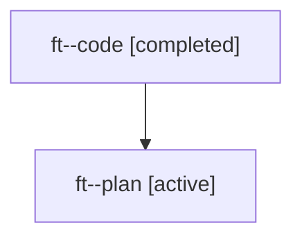

# Family: ft

[Agent Hoods](../README.md) / [bbugyi200](../users/bbugyi200/README.md) / [athena](../users/bbugyi200/machines/athena/README.md) / [ft](../users/bbugyi200/machines/athena/hoods/ft/README.md) / ft

Owner: `bbugyi200.athena` · Hood: `ft` · Members: 2

## Lineage

The diagram is an optional enhancement; the ordered table below contains the same lineage in accessible text.

| Role | Agent | State | Model / provider | Timing | Commits | Prompt | Chat |
|---|---|---|---|---|---:|---|---|
| code | ft--code | completed | gpt-5.6-sol / codex | 2026-07-20T11:56:07.431823+00:00 | [1](../agents/bbugyi200.athena.ft--code/README.md#commits) | — | [Chat](../agents/bbugyi200.athena.ft--code/chat.md) |
| plan | ft--plan | active | gpt-5.6-sol / codex | 2026-07-20T11:46:11.591530+00:00 | 0 | [Prompt](../agents/bbugyi200.athena.ft--plan/prompt.md) | [Chat](../agents/bbugyi200.athena.ft--plan/chat.md) |

## Commits

| Role | Repo | Commit | Subject | Committed |
|---|---|---|---|---|
| code | sase | [`6e0ad18`](https://github.com/sase-org/sase/commit/6e0ad1830f66247437962c50a3fe5a583188c084) | fix(tui): preserve Updates sub-tab key dispatch | 2026-07-20 08:21:10 EDT |
