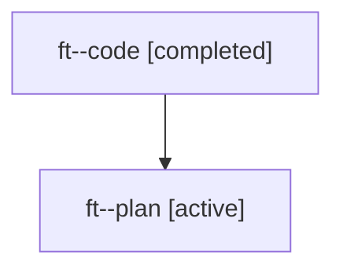

# Family: ft

Owner: `bbugyi200.athena` · Hood: `ft` · Members: 2

## Lineage

The diagram is an optional enhancement; the ordered table below contains the same lineage in accessible text.

| Role | Agent | State | Model / provider | Timing | Commits | Prompt | Chat |
|---|---|---|---|---|---:|---|---|
| code | ft--code | completed | gpt-5.6-sol / codex | 2026-07-20T11:56:07.431823+00:00 | 1 | — | [Chat](../agents/bbugyi200.athena.ft--code/chat.md) |
| plan | ft--plan | active | gpt-5.6-sol / codex | 2026-07-20T11:46:11.591530+00:00 | 0 | [Prompt](../agents/bbugyi200.athena.ft--plan/prompt.md) | [Chat](../agents/bbugyi200.athena.ft--plan/chat.md) |
