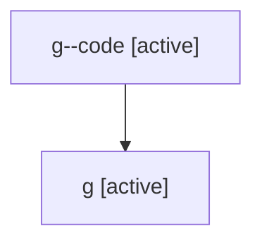

# Family: g

Owner: `bbugyi200.athena` · Hood: `g` · Members: 2

## Lineage

The diagram is an optional enhancement; the ordered table below contains the same lineage in accessible text.

| Role | Agent | State | Model / provider | Timing | Commits | Prompt | Chat |
|---|---|---|---|---|---:|---|---|
| code | g--code | active | opus / claude | 2026-07-06T17:57:03.866553+00:00 | 0 | — | — |
| root | g | active | gpt-5.5 / codex | 2026-07-06T17:52:36.663731+00:00 | 1 | [Prompt](../agents/bbugyi200.athena.g/prompt.md) | [Chat](../agents/bbugyi200.athena.g/chat.md) |
