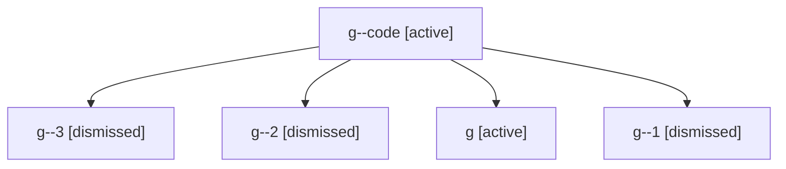

# Family: g

[Agent Hoods](../README.md) / [bbugyi200](../users/bbugyi200/README.md) / [athena](../users/bbugyi200/machines/athena/README.md) / [g](../users/bbugyi200/machines/athena/hoods/g/README.md) / g

Owner: `bbugyi200.athena` · Hood: `g` · Members: 5

## Lineage

The diagram is an optional enhancement; the ordered table below contains the same lineage in accessible text.

| Role | Agent | State | Model / provider | Timing | Commits | Prompt | Chat |
|---|---|---|---|---|---:|---|---|
| code | g--code | active | opus / claude | 2026-07-06T17:57:03.866553+00:00 | 0 | — | — |
| 3 | g--3 | dismissed | sonnet / claude | 2026-09-10T12:57:17.302157 | 0 | — | — |
| 2 | g--2 | dismissed | sonnet / claude | 2026-09-10T12:57:17.300931 | 0 | — | — |
| root | g | active | gpt-5.5 / codex | 2026-07-06T17:52:36.663731+00:00 | [1](../agents/bbugyi200.athena.g/README.md#commits) | [Prompt](../agents/bbugyi200.athena.g/prompt.md) | [Chat](../agents/bbugyi200.athena.g/chat.md) |
| 1 | g--1 | dismissed | sonnet / claude | 2026-09-10T12:57:17.300026 | 0 | — | — |

## Commits

| Role | Repo | Commit | Subject | Committed |
|---|---|---|---|---|
| root | sase | [`a565355`](https://github.com/sase-org/sase/commit/a5653558650161f551d09d341259eb857ad7f4fa) | chore: Add SDD prompt and plan for kill\_child\_agent\_entries | 2026-07-06 13:57:02 EDT |
