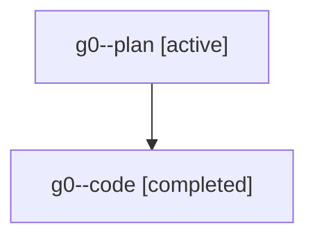

# Family: g0

[Agent Hoods](../README.md) / [bbugyi200](../users/bbugyi200/README.md) / [athena](../users/bbugyi200/machines/athena/README.md) / [g0](../users/bbugyi200/machines/athena/hoods/g0/README.md) / g0

Owner: `bbugyi200.athena` · Hood: `g0` · Members: 2

## Lineage

The diagram is an optional enhancement; the ordered table below contains the same lineage in accessible text.

| Role | Agent | State | Model / provider | Timing | Commits | Prompt | Chat |
|---|---|---|---|---|---:|---|---|
| plan | g0--plan | active | claude-fable-5 / claude | 2026-07-20T13:17:18.506687+00:00 | 0 | [Prompt](../agents/bbugyi200.athena.g0--plan/prompt.md) | [Chat](../agents/bbugyi200.athena.g0--plan/chat.md) |
| code | g0--code | completed | gpt-5.6-sol / codex | 2026-07-20T13:30:51.684796+00:00 | [1](../agents/bbugyi200.athena.g0--code/README.md#commits) | — | [Chat](../agents/bbugyi200.athena.g0--code/chat.md) |

## Commits

| Role | Commit | Subject | Committed (UTC) |
|---|---|---|---|
| code | [`88c1a7b`](https://github.com/sase-org/sase/commit/88c1a7b9eced3c45ab36a5673257714b6fe2c4ba) | feat(test): gate parallel suites by host capacity | 2026-07-20 13:44:14 |

## Neighbors

| Agent | Relation | State |
|---|---|---|
| [g0.f0](../agents/bbugyi200.athena.g0.f0/README.md) | descendant | active |
