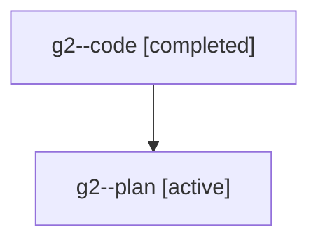

# Family: g2

[Agent Hoods](../README.md) / [bbugyi200](../users/bbugyi200/README.md) / [athena](../users/bbugyi200/machines/athena/README.md) / [g2](../users/bbugyi200/machines/athena/hoods/g2/README.md) / g2

Owner: `bbugyi200.athena` · Hood: `g2` · Members: 2

## Lineage

The diagram is an optional enhancement; the ordered table below contains the same lineage in accessible text.

| Role | Agent | State | Model / provider | Timing | Commits | Prompt | Chat |
|---|---|---|---|---|---:|---|---|
| code | g2--code | completed | gpt-5.6-sol / codex | 2026-07-20T14:00:58.396400+00:00 | [1](../agents/bbugyi200.athena.g2--code/README.md#commits) | — | [Chat](../agents/bbugyi200.athena.g2--code/chat.md) |
| plan | g2--plan | active | gpt-5.6-sol / codex | 2026-07-20T13:48:23.230246+00:00 | 0 | [Prompt](../agents/bbugyi200.athena.g2--plan/prompt.md) | [Chat](../agents/bbugyi200.athena.g2--plan/chat.md) |

## Commits

| Role | Commit | Subject | Committed (UTC) |
|---|---|---|---|
| code | [`59678a2`](https://github.com/sase-org/sase/commit/59678a281813e7b9e90525dfb824140de1dd99ed) | fix: restore epic tribe when resuming bead work | 2026-07-20 14:11:02 |
