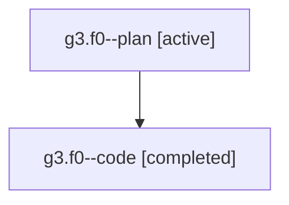

# Family: g3.f0

[Agent Hoods](../README.md) / [bbugyi200](../users/bbugyi200/README.md) / [athena](../users/bbugyi200/machines/athena/README.md) / [g3](../users/bbugyi200/machines/athena/hoods/g3/README.md) / g3.f0

Owner: `bbugyi200.athena` · Hood: `g3` · Members: 2

## Lineage

The diagram is an optional enhancement; the ordered table below contains the same lineage in accessible text.

| Role | Agent | State | Model / provider | Timing | Commits | Prompt | Chat |
|---|---|---|---|---|---:|---|---|
| plan | g3.f0--plan | active | gpt-5.6-sol / codex | 2026-07-20T14:23:46.006684+00:00 | 0 | [Prompt](../agents/bbugyi200.athena.g3.f0--plan/prompt.md) | [Chat](../agents/bbugyi200.athena.g3.f0--plan/chat.md) |
| code | g3.f0--code | completed | gpt-5.6-sol / codex | 2026-07-20T14:27:10.068862+00:00 | [1](../agents/bbugyi200.athena.g3.f0--code/README.md#commits) | — | [Chat](../agents/bbugyi200.athena.g3.f0--code/chat.md) |

## Commits

| Role | Repo | Commit | Subject | Committed (UTC) |
|---|---|---|---|---|
| code | sase | [`0b44bc6`](https://github.com/sase-org/sase/commit/0b44bc602ff94934efa0494ca2f7735aac49f6e1) | fix(tui): simplify runner capacity header | 2026-07-20 14:40:25 |

## Neighbors

| Agent | Relation | State |
|---|---|---|
| [g3](../agents/bbugyi200.athena.g3/README.md) | ancestor | active |
