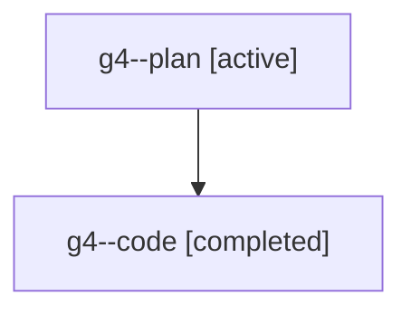

# Family: g4

[Agent Hoods](../README.md) / [bbugyi200](../users/bbugyi200/README.md) / [athena](../users/bbugyi200/machines/athena/README.md) / [g4](../users/bbugyi200/machines/athena/hoods/g4/README.md) / g4

Owner: `bbugyi200.athena` · Hood: `g4` · Members: 2

## Lineage

The diagram is an optional enhancement; the ordered table below contains the same lineage in accessible text.

| Role | Agent | State | Model / provider | Timing | Commits | Prompt | Chat |
|---|---|---|---|---|---:|---|---|
| plan | g4--plan | active | gpt-5.6-sol / codex | 2026-07-20T13:59:47.733337+00:00 | 0 | [Prompt](../agents/bbugyi200.athena.g4--plan/prompt.md) | [Chat](../agents/bbugyi200.athena.g4--plan/chat.md) |
| code | g4--code | completed | gpt-5.6-sol / codex | 2026-07-20T14:04:58.329644+00:00 | 0 | — | [Chat](../agents/bbugyi200.athena.g4--code/chat.md) |
