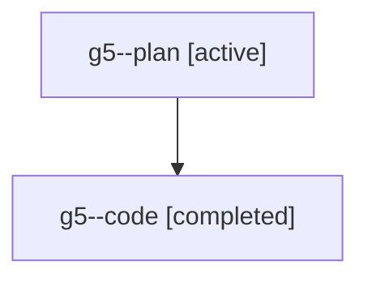

# Family: g5

[Agent Hoods](../README.md) / [bbugyi200](../users/bbugyi200/README.md) / [athena](../users/bbugyi200/machines/athena/README.md) / [g5](../users/bbugyi200/machines/athena/hoods/g5/README.md) / g5

Owner: `bbugyi200.athena` · Hood: `g5` · Members: 2

## Lineage

The diagram is an optional enhancement; the ordered table below contains the same lineage in accessible text.

| Role | Agent | State | Model / provider | Timing | Commits | Prompt | Chat |
|---|---|---|---|---|---:|---|---|
| plan | g5--plan | active | gpt-5.6-sol / codex | 2026-07-20T14:06:39.369452+00:00 | 0 | [Prompt](../agents/bbugyi200.athena.g5--plan/prompt.md) | [Chat](../agents/bbugyi200.athena.g5--plan/chat.md) |
| code | g5--code | completed | gpt-5.6-sol / codex | 2026-07-20T14:17:26.311256+00:00 | [1](../agents/bbugyi200.athena.g5--code/README.md#commits) | — | [Chat](../agents/bbugyi200.athena.g5--code/chat.md) |

## Commits

| Role | Repo | Commit | Subject | Committed (UTC) |
|---|---|---|---|---|
| code | sase | [`ce12818`](https://github.com/sase-org/sase/commit/ce128180aab455b120fe453155aa287fb4429834) | fix(tui): preserve tribe fold intent across updates | 2026-07-20 14:51:21 |
