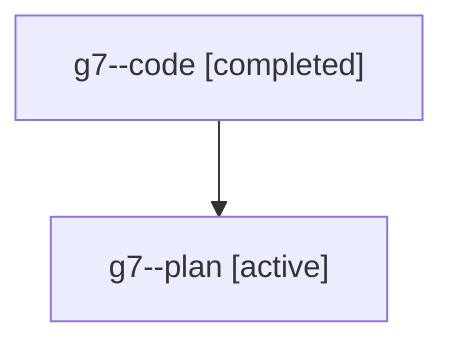

# Family: g7

[Agent Hoods](../README.md) / [bbugyi200](../users/bbugyi200/README.md) / [athena](../users/bbugyi200/machines/athena/README.md) / [g7](../users/bbugyi200/machines/athena/hoods/g7/README.md) / g7

Owner: `bbugyi200.athena` · Hood: `g7` · Members: 2

## Lineage

The diagram is an optional enhancement; the ordered table below contains the same lineage in accessible text.

| Role | Agent | State | Model / provider | Timing | Commits | Prompt | Chat |
|---|---|---|---|---|---:|---|---|
| code | g7--code | completed | gpt-5.6-sol / codex | 2026-07-20T14:40:30.210339+00:00 | [1](../agents/bbugyi200.athena.g7--code/README.md#commits) | — | [Chat](../agents/bbugyi200.athena.g7--code/chat.md) |
| plan | g7--plan | active | gpt-5.6-sol / codex | 2026-07-20T14:30:26.984546+00:00 | 0 | [Prompt](../agents/bbugyi200.athena.g7--plan/prompt.md) | [Chat](../agents/bbugyi200.athena.g7--plan/chat.md) |

## Commits

| Role | Repo | Commit | Subject | Committed (UTC) |
|---|---|---|---|---|
| code | sase | [`286a809`](https://github.com/sase-org/sase/commit/286a8090666bc2587736e1f143d0ba631741bde6) | feat(ace): show phase bead and authored plan context | 2026-07-20 15:29:20 |
