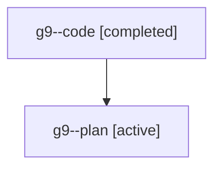

# Family: g9

Owner: `bbugyi200.athena` · Hood: `g9` · Members: 2

## Lineage

The diagram is an optional enhancement; the ordered table below contains the same lineage in accessible text.

| Role | Agent | State | Model / provider | Timing | Commits | Prompt | Chat |
|---|---|---|---|---|---:|---|---|
| code | g9--code | completed | gpt-5.6-sol / codex | 2026-07-20T14:53:58.053751+00:00 | 1 | — | [Chat](../agents/bbugyi200.athena.g9--code/chat.md) |
| plan | g9--plan | active | gpt-5.6-sol / codex | 2026-07-20T14:42:41.356197+00:00 | 0 | [Prompt](../agents/bbugyi200.athena.g9--plan/prompt.md) | [Chat](../agents/bbugyi200.athena.g9--plan/chat.md) |
