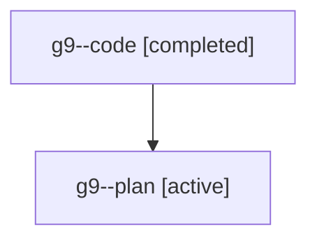

# Family: g9

[Agent Hoods](../README.md) / [bbugyi200](../users/bbugyi200/README.md) / [athena](../users/bbugyi200/machines/athena/README.md) / [g9](../users/bbugyi200/machines/athena/hoods/g9/README.md) / g9

Owner: `bbugyi200.athena` · Hood: `g9` · Members: 2

## Lineage

The diagram is an optional enhancement; the ordered table below contains the same lineage in accessible text.

| Role | Agent | State | Model / provider | Timing | Commits | Prompt | Chat |
|---|---|---|---|---|---:|---|---|
| code | g9--code | completed | gpt-5.6-sol / codex | 2026-07-20T14:53:58.053751+00:00 | [1](../agents/bbugyi200.athena.g9--code/README.md#commits) | — | [Chat](../agents/bbugyi200.athena.g9--code/chat.md) |
| plan | g9--plan | active | gpt-5.6-sol / codex | 2026-07-20T14:42:41.356197+00:00 | 0 | [Prompt](../agents/bbugyi200.athena.g9--plan/prompt.md) | [Chat](../agents/bbugyi200.athena.g9--plan/chat.md) |

## Commits

| Role | Repo | Commit | Subject | Committed |
|---|---|---|---|---|
| code | sase | [`b4d689f`](https://github.com/sase-org/sase/commit/b4d689f53d6e397f8ef6e3a0b733321e4d9934da) | fix: resolve waits for dismissed clan members | 2026-07-20 15:21:11 UTC |
