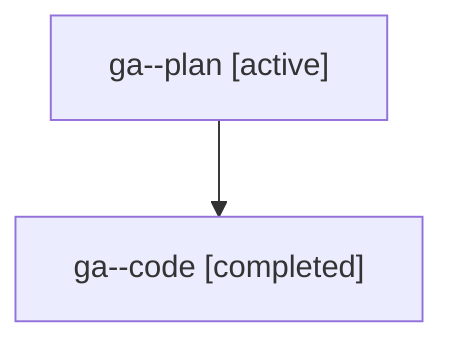

# Family: ga

[Agent Hoods](../README.md) / [bbugyi200](../users/bbugyi200/README.md) / [athena](../users/bbugyi200/machines/athena/README.md) / [ga](../users/bbugyi200/machines/athena/hoods/ga/README.md) / ga

Owner: `bbugyi200.athena` · Hood: `ga` · Members: 2

## Lineage

The diagram is an optional enhancement; the ordered table below contains the same lineage in accessible text.

| Role | Agent | State | Model / provider | Timing | Commits | Prompt | Chat |
|---|---|---|---|---|---:|---|---|
| plan | ga--plan | active | gpt-5.6-sol / codex | 2026-07-20T14:57:38.499730+00:00 | 0 | [Prompt](../agents/bbugyi200.athena.ga--plan/prompt.md) | [Chat](../agents/bbugyi200.athena.ga--plan/chat.md) |
| code | ga--code | completed | gpt-5.6-sol / codex | 2026-07-20T15:03:34.836274+00:00 | [1](../agents/bbugyi200.athena.ga--code/README.md#commits) | — | [Chat](../agents/bbugyi200.athena.ga--code/chat.md) |

## Commits

| Role | Commit | Subject | Committed (UTC) |
|---|---|---|---|
| code | [`0bbf415`](https://github.com/sase-org/sase/commit/0bbf41585be894812dcb2bec927bcd7f0558ff45) | fix: serialize approved epic plan launches | 2026-07-20 15:25:08 |
