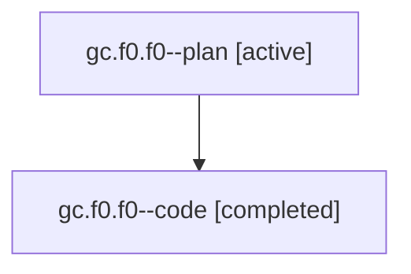

# Family: gc.f0.f0

[Agent Hoods](../README.md) / [bbugyi200](../users/bbugyi200/README.md) / [athena](../users/bbugyi200/machines/athena/README.md) / [gc](../users/bbugyi200/machines/athena/hoods/gc/README.md) / gc.f0.f0

Owner: `bbugyi200.athena` · Hood: `gc` · Members: 2

## Lineage

The diagram is an optional enhancement; the ordered table below contains the same lineage in accessible text.

| Role | Agent | State | Model / provider | Timing | Commits | Prompt | Chat |
|---|---|---|---|---|---:|---|---|
| plan | gc.f0.f0--plan | active | gpt-5.6-sol / codex | 2026-07-20T17:28:11.446229+00:00 | 0 | [Prompt](../agents/bbugyi200.athena.gc.f0.f0--plan/prompt.md) | [Chat](../agents/bbugyi200.athena.gc.f0.f0--plan/chat.md) |
| code | gc.f0.f0--code | completed | gpt-5.6-sol / codex | 2026-07-20T17:36:30.264934+00:00 | [1](../agents/bbugyi200.athena.gc.f0.f0--code/README.md#commits) | — | [Chat](../agents/bbugyi200.athena.gc.f0.f0--code/chat.md) |

## Commits

| Role | Repo | Commit | Subject | Committed |
|---|---|---|---|---|
| code | sase | [`145f287`](https://github.com/sase-org/sase/commit/145f2876e8013faa2fc3f7aa8fb48ef2f76ed4cc) | feat(ace): resume last Admin Center section | 2026-07-20 14:07:02 EDT |

## Neighbors

| Agent | Relation | State |
|---|---|---|
| [gc.f0](bbugyi200.athena.gc.f0.md) (family · 2) | ancestor | active 1, completed 1 |
| [gc](bbugyi200.athena.gc.md) (family · 2) | ancestor | active 1, completed 1 |
