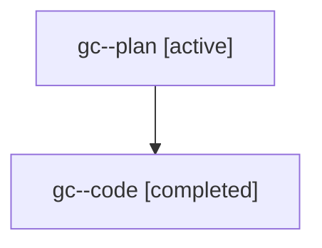

# Family: gc

[Agent Hoods](../README.md) / [bbugyi200](../users/bbugyi200/README.md) / [athena](../users/bbugyi200/machines/athena/README.md) / [gc](../users/bbugyi200/machines/athena/hoods/gc/README.md) / gc

Owner: `bbugyi200.athena` · Hood: `gc` · Members: 2

## Lineage

The diagram is an optional enhancement; the ordered table below contains the same lineage in accessible text.

| Role | Agent | State | Model / provider | Timing | Commits | Prompt | Chat |
|---|---|---|---|---|---:|---|---|
| plan | gc--plan | active | gpt-5.6-sol / codex | 2026-07-20T15:41:26.411680+00:00 | 0 | [Prompt](../agents/bbugyi200.athena.gc--plan/prompt.md) | [Chat](../agents/bbugyi200.athena.gc--plan/chat.md) |
| code | gc--code | completed | gpt-5.6-sol / codex | 2026-07-20T15:49:36.522512+00:00 | 0 | — | [Chat](../agents/bbugyi200.athena.gc--code/chat.md) |

## Commits

| Role | Repo | Commit | Subject | Committed |
|---|---|---|---|---|
| — | sase | [`605fbeb`](https://github.com/sase-org/sase/commit/605fbebd1064af07a5f92320393fa5efddfd687f) | feat(ace): add lazy Admin Center landing page | 2026-07-20 12:47:42 EDT |

## Neighbors

| Agent | Relation | State |
|---|---|---|
| [gc.f0](bbugyi200.athena.gc.f0.md) (family · 2) | descendant | active 1, completed 1 |
| [gc.f0](../agents/bbugyi200.athena.gc.f0/README.md) | descendant | completed |
| [gc.f0.f0](bbugyi200.athena.gc.f0.f0.md) (family · 2) | descendant | active 1, completed 1 |
| [gc.f0.f0](../agents/bbugyi200.athena.gc.f0.f0/README.md) | descendant | completed |
