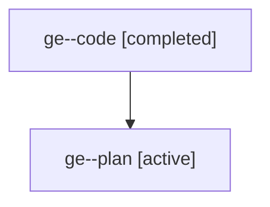

# Family: ge

[Agent Hoods](../README.md) / [bbugyi200](../users/bbugyi200/README.md) / [athena](../users/bbugyi200/machines/athena/README.md) / [ge](../users/bbugyi200/machines/athena/hoods/ge/README.md) / ge

Owner: `bbugyi200.athena` · Hood: `ge` · Members: 2

## Lineage

The diagram is an optional enhancement; the ordered table below contains the same lineage in accessible text.

| Role | Agent | State | Model / provider | Timing | Commits | Prompt | Chat |
|---|---|---|---|---|---:|---|---|
| code | ge--code | completed | gpt-5.6-sol / codex | 2026-07-20T16:46:23.959059+00:00 | 0 | — | [Chat](../agents/bbugyi200.athena.ge--code/chat.md) |
| plan | ge--plan | active | gpt-5.6-sol / codex | 2026-07-20T16:36:07.354256+00:00 | 0 | [Prompt](../agents/bbugyi200.athena.ge--plan/prompt.md) | [Chat](../agents/bbugyi200.athena.ge--plan/chat.md) |

## Commits

| Role | Repo | Commit | Subject | Committed |
|---|---|---|---|---|
| — | sase | [`4b083e8`](https://github.com/sase-org/sase/commit/4b083e8332f2f2c82439b441294c76cd14c3243d) | feat(stats): show concise range summary | 2026-07-20 17:04:35 UTC |
