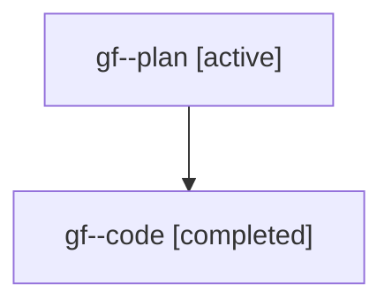

# Family: gf

[Agent Hoods](../README.md) / [bbugyi200](../users/bbugyi200/README.md) / [athena](../users/bbugyi200/machines/athena/README.md) / [gf](../users/bbugyi200/machines/athena/hoods/gf/README.md) / gf

Owner: `bbugyi200.athena` · Hood: `gf` · Members: 2

## Lineage

The diagram is an optional enhancement; the ordered table below contains the same lineage in accessible text.

| Role | Agent | State | Model / provider | Timing | Commits | Prompt | Chat |
|---|---|---|---|---|---:|---|---|
| plan | gf--plan | active | gpt-5.6-sol / codex | 2026-07-20T17:05:55.617936+00:00 | 0 | [Prompt](../agents/bbugyi200.athena.gf--plan/prompt.md) | [Chat](../agents/bbugyi200.athena.gf--plan/chat.md) |
| code | gf--code | completed | gpt-5.6-sol / codex | 2026-07-20T17:12:32.323590+00:00 | [1](../agents/bbugyi200.athena.gf--code/README.md#commits) | — | [Chat](../agents/bbugyi200.athena.gf--code/chat.md) |

## Commits

| Role | Commit | Subject | Committed (UTC) |
|---|---|---|---|
| code | [`c7d1e39`](https://github.com/sase-org/sase/commit/c7d1e393fdc40238619af433cb1939623be90e8e) | feat(vcs): hide sidecar commits by default | 2026-07-20 17:49:02 |
