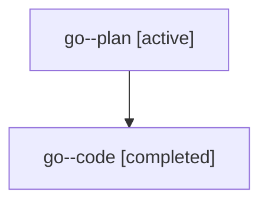

# Family: go

[Agent Hoods](../README.md) / [bbugyi200](../users/bbugyi200/README.md) / [athena](../users/bbugyi200/machines/athena/README.md) / [go](../users/bbugyi200/machines/athena/hoods/go/README.md) / go

Owner: `bbugyi200.athena` · Hood: `go` · Members: 2

## Lineage

The diagram is an optional enhancement; the ordered table below contains the same lineage in accessible text.

| Role | Agent | State | Model / provider | Timing | Commits | Prompt | Chat |
|---|---|---|---|---|---:|---|---|
| plan | go--plan | active | gpt-5.6-sol / codex | 2026-07-20T21:21:37.650997+00:00 | 0 | [Prompt](../agents/bbugyi200.athena.go--plan/prompt.md) | [Chat](../agents/bbugyi200.athena.go--plan/chat.md) |
| code | go--code | completed | gpt-5.6-sol / codex | 2026-07-20T21:28:23.039699+00:00 | [1](../agents/bbugyi200.athena.go--code/README.md#commits) | — | [Chat](../agents/bbugyi200.athena.go--code/chat.md) |

## Commits

| Role | Repo | Commit | Subject | Committed |
|---|---|---|---|---|
| code | sase | [`982e51e`](https://github.com/sase-org/sase/commit/982e51e6b78ff1bf8698ce94b37bd33c6554a2e4) | fix(agent): derive template clan declarations from members | 2026-07-20 21:46:51 UTC |
