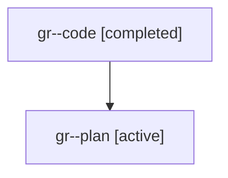

# Family: gr

[Agent Hoods](../README.md) / [bbugyi200](../users/bbugyi200/README.md) / [athena](../users/bbugyi200/machines/athena/README.md) / [gr](../users/bbugyi200/machines/athena/hoods/gr/README.md) / gr

Owner: `bbugyi200.athena` · Hood: `gr` · Members: 2

## Lineage

The diagram is an optional enhancement; the ordered table below contains the same lineage in accessible text.

| Role | Agent | State | Model / provider | Timing | Commits | Prompt | Chat |
|---|---|---|---|---|---:|---|---|
| code | gr--code | completed | gpt-5.6-sol / codex | 2026-07-21T11:51:34.430181+00:00 | [1](../agents/bbugyi200.athena.gr--code/README.md#commits) | — | [Chat](../agents/bbugyi200.athena.gr--code/chat.md) |
| plan | gr--plan | active | gpt-5.6-sol / codex | 2026-07-21T11:47:12.067517+00:00 | 0 | [Prompt](../agents/bbugyi200.athena.gr--plan/prompt.md) | [Chat](../agents/bbugyi200.athena.gr--plan/chat.md) |

## Commits

| Role | Repo | Commit | Subject | Committed |
|---|---|---|---|---|
| code | sase | [`0e38edf`](https://github.com/sase-org/sase/commit/0e38edf56bf8fb7266362e95504b5477d7b1864f) | feat(ace): reorder Artifacts subtabs | 2026-07-21 08:23:11 EDT |

## Neighbors

| Agent | Relation | State |
|---|---|---|
| [gr.w0](../agents/bbugyi200.athena.gr.w0/README.md) | descendant | active |
| [gr.w2](bbugyi200.athena.gr.w2.md) (family · 2) | descendant | active 1, completed 1 |
| [gr.w2](../agents/bbugyi200.athena.gr.w2/README.md) | descendant | completed |
