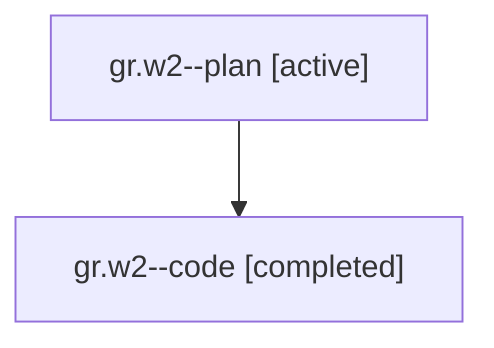

# Family: gr.w2

[Agent Hoods](../README.md) / [bbugyi200](../users/bbugyi200/README.md) / [athena](../users/bbugyi200/machines/athena/README.md) / [gr](../users/bbugyi200/machines/athena/hoods/gr/README.md) / gr.w2

Owner: `bbugyi200.athena` · Hood: `gr` · Members: 2

## Lineage

The diagram is an optional enhancement; the ordered table below contains the same lineage in accessible text.

| Role | Agent | State | Model / provider | Timing | Commits | Prompt | Chat |
|---|---|---|---|---|---:|---|---|
| plan | gr.w2--plan | active | gpt-5.6-sol / codex | 2026-07-21T12:23:49.262048+00:00 | 0 | [Prompt](../agents/bbugyi200.athena.gr.w2--plan/prompt.md) | [Chat](../agents/bbugyi200.athena.gr.w2--plan/chat.md) |
| code | gr.w2--code | completed | gpt-5.6-sol / codex | 2026-07-21T12:35:17.900538+00:00 | [1](../agents/bbugyi200.athena.gr.w2--code/README.md#commits) | — | [Chat](../agents/bbugyi200.athena.gr.w2--code/chat.md) |

## Commits

| Role | Commit | Subject | Committed (UTC) |
|---|---|---|---|
| code | [`4f86191`](https://github.com/sase-org/sase/commit/4f86191c2866975f8ca40173345a3adf01617035) | feat(ace): persist the commits default filter | 2026-07-21 13:10:39 |

## Neighbors

| Agent | Relation | State |
|---|---|---|
| [gr](../agents/bbugyi200.athena.gr/README.md) | ancestor | completed |
| [gr.w0](../agents/bbugyi200.athena.gr.w0/README.md) | gr hood | active |
