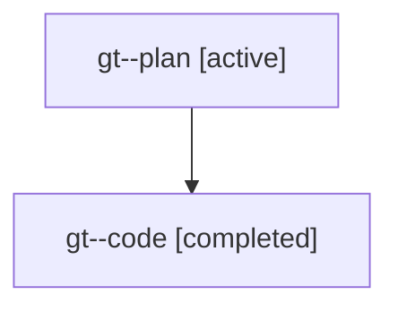

# Family: gt

[Agent Hoods](../README.md) / [bbugyi200](../users/bbugyi200/README.md) / [athena](../users/bbugyi200/machines/athena/README.md) / [gt](../users/bbugyi200/machines/athena/hoods/gt/README.md) / gt

Owner: `bbugyi200.athena` · Hood: `gt` · Members: 2

## Lineage

The diagram is an optional enhancement; the ordered table below contains the same lineage in accessible text.

| Role | Agent | State | Model / provider | Timing | Commits | Prompt | Chat |
|---|---|---|---|---|---:|---|---|
| plan | gt--plan | active | gpt-5.6-sol / codex | 2026-07-21T11:52:44.725918+00:00 | 0 | [Prompt](../agents/bbugyi200.athena.gt--plan/prompt.md) | [Chat](../agents/bbugyi200.athena.gt--plan/chat.md) |
| code | gt--code | completed | gpt-5.6-sol / codex | 2026-07-21T11:57:38.314637+00:00 | [1](../agents/bbugyi200.athena.gt--code/README.md#commits) | — | [Chat](../agents/bbugyi200.athena.gt--code/chat.md) |

## Commits

| Role | Commit | Subject | Committed (UTC) |
|---|---|---|---|
| code | [`7630f7f`](https://github.com/sase-org/sase/commit/7630f7f26273eb6c02ee97c56ea833e8258d5ffd) | fix(tui): highlight selected collapsed tribe titles | 2026-07-21 12:15:26 |
