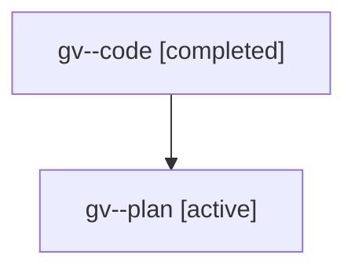

# Family: gv

[Agent Hoods](../README.md) / [bbugyi200](../users/bbugyi200/README.md) / [athena](../users/bbugyi200/machines/athena/README.md) / [gv](../users/bbugyi200/machines/athena/hoods/gv/README.md) / gv

Owner: `bbugyi200.athena` · Hood: `gv` · Members: 2

## Lineage

The diagram is an optional enhancement; the ordered table below contains the same lineage in accessible text.

| Role | Agent | State | Model / provider | Timing | Commits | Prompt | Chat |
|---|---|---|---|---|---:|---|---|
| code | gv--code | completed | gpt-5.6-sol / codex | 2026-07-21T12:10:26.258344+00:00 | [1](../agents/bbugyi200.athena.gv--code/README.md#commits) | — | [Chat](../agents/bbugyi200.athena.gv--code/chat.md) |
| plan | gv--plan | active | gpt-5.6-sol / codex | 2026-07-21T12:04:50.406761+00:00 | 0 | [Prompt](../agents/bbugyi200.athena.gv--plan/prompt.md) | [Chat](../agents/bbugyi200.athena.gv--plan/chat.md) |

## Commits

| Role | Repo | Commit | Subject | Committed |
|---|---|---|---|---|
| code | sase | [`6cbb38f`](https://github.com/sase-org/sase/commit/6cbb38faf62635b8e070ec66347ff118c2d6bd3d) | fix(ace): enable view hints for agent families | 2026-07-21 12:26:34 UTC |
