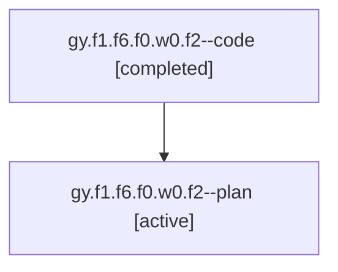

# Family: gy.f1.f6.f0.w0.f2

[Agent Hoods](../README.md) / [bbugyi200](../users/bbugyi200/README.md) / [athena](../users/bbugyi200/machines/athena/README.md) / [gy](../users/bbugyi200/machines/athena/hoods/gy/README.md) / gy.f1.f6.f0.w0.f2

Owner: `bbugyi200.athena` · Hood: `gy` · Members: 2

## Lineage

The diagram is an optional enhancement; the ordered table below contains the same lineage in accessible text.

| Role | Agent | State | Model / provider | Timing | Commits | Prompt | Chat |
|---|---|---|---|---|---:|---|---|
| code | gy.f1.f6.f0.w0.f2--code | completed | gpt-5.6-sol / codex | 2026-07-21T15:46:38.153363+00:00 | 0 | — | [Chat](../agents/bbugyi200.athena.gy.f1.f6.f0.w0.f2--code/chat.md) |
| plan | gy.f1.f6.f0.w0.f2--plan | active | gpt-5.6-sol / codex | 2026-07-21T15:35:55.868954+00:00 | 0 | [Prompt](../agents/bbugyi200.athena.gy.f1.f6.f0.w0.f2--plan/prompt.md) | [Chat](../agents/bbugyi200.athena.gy.f1.f6.f0.w0.f2--plan/chat.md) |

## Commits

| Role | Repo | Commit | Subject | Committed |
|---|---|---|---|---|
| — | sase | [`a2c33ea`](https://github.com/sase-org/sase/commit/a2c33ea03d1936d0f953ed9448ade95c2c5dd3c5) | feat(ace): add default effort controls to Models panel | 2026-07-21 12:37:55 EDT |

## Neighbors

| Agent | Relation | State |
|---|---|---|
| [gy.f1.f6.f0.w0](bbugyi200.athena.gy.f1.f6.f0.w0.md) (family · 2) | ancestor | active 1, completed 1 |
| [gy.f1.f6.f0](../agents/bbugyi200.athena.gy.f1.f6.f0/README.md) | ancestor | dismissed |
| [gy.f1](bbugyi200.athena.gy.f1.md) (family · 2) | ancestor | active 1, completed 1 |
| [gy](bbugyi200.athena.gy.md) (family · 2) | ancestor | active 1, completed 1 |
| [gy.f1.f6.f0.w0.f2.f1](../agents/bbugyi200.athena.gy.f1.f6.f0.w0.f2.f1/README.md) | descendant | active |
| [gy.f1.f6.f0.w0.f0](../agents/bbugyi200.athena.gy.f1.f6.f0.w0.f0/README.md) | gy.f1.f6.f0.w0 hood | waiting |
| [gy.f1.f6.f1](../agents/bbugyi200.athena.gy.f1.f6.f1/README.md) | gy.f1.f6 hood | active |
| [gy.f1.f0](../agents/bbugyi200.athena.gy.f1.f0/README.md) | gy.f1 hood | waiting |
| [gy.f1.f1](../agents/bbugyi200.athena.gy.f1.f1/README.md) | gy.f1 hood | waiting |
| [gy.f1.f2](../agents/bbugyi200.athena.gy.f1.f2/README.md) | gy.f1 hood | waiting |
| [gy.f1.f3](../agents/bbugyi200.athena.gy.f1.f3/README.md) | gy.f1 hood | waiting |
| [gy.f1.f4](../agents/bbugyi200.athena.gy.f1.f4/README.md) | gy.f1 hood | active |
| [gy.f1.f5](../agents/bbugyi200.athena.gy.f1.f5/README.md) | gy.f1 hood | active |
| [gy.f1.f7](bbugyi200.athena.gy.f1.f7.md) (family · 2) | gy.f1 hood | active 1, completed 1 |
| [gy.f1.f8](bbugyi200.athena.gy.f1.f8.md) (family · 2) | gy.f1 hood | active 1, completed 1 |
| [gy.f1.f8.f0](bbugyi200.athena.gy.f1.f8.f0.md) (family · 2) | gy.f1 hood | active 1, completed 1 |
| [gy.f0](../agents/bbugyi200.athena.gy.f0/README.md) | gy hood | active |
