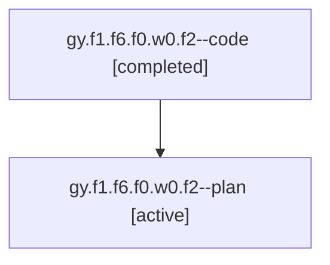

# Family: gy.f1.f6.f0.w0.f2

Owner: `bbugyi200.athena` · Hood: `gy` · Members: 2

## Lineage

The diagram is an optional enhancement; the ordered table below contains the same lineage in accessible text.

| Role | Agent | State | Model / provider | Timing | Commits | Prompt | Chat |
|---|---|---|---|---|---:|---|---|
| code | gy.f1.f6.f0.w0.f2--code | completed | gpt-5.6-sol / codex | 2026-07-21T15:46:38.153363+00:00 | 0 | — | [Chat](../agents/bbugyi200.athena.gy.f1.f6.f0.w0.f2--code/chat.md) |
| plan | gy.f1.f6.f0.w0.f2--plan | active | gpt-5.6-sol / codex | 2026-07-21T15:35:55.868954+00:00 | 0 | [Prompt](../agents/bbugyi200.athena.gy.f1.f6.f0.w0.f2--plan/prompt.md) | [Chat](../agents/bbugyi200.athena.gy.f1.f6.f0.w0.f2--plan/chat.md) |
