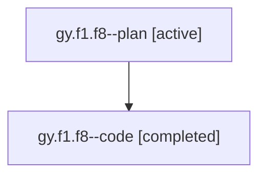

# Family: gy.f1.f8

Owner: `bbugyi200.athena` · Hood: `gy` · Members: 2

## Lineage

The diagram is an optional enhancement; the ordered table below contains the same lineage in accessible text.

| Role | Agent | State | Model / provider | Timing | Commits | Prompt | Chat |
|---|---|---|---|---|---:|---|---|
| plan | gy.f1.f8--plan | active | gpt-5.6-sol / codex | 2026-07-21T13:58:24.734386+00:00 | 0 | [Prompt](../agents/bbugyi200.athena.gy.f1.f8--plan/prompt.md) | [Chat](../agents/bbugyi200.athena.gy.f1.f8--plan/chat.md) |
| code | gy.f1.f8--code | completed | gpt-5.6-sol / codex | 2026-07-21T14:06:12.861434+00:00 | 1 | — | [Chat](../agents/bbugyi200.athena.gy.f1.f8--code/chat.md) |
