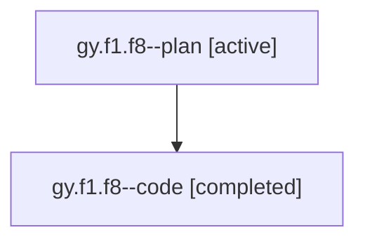

# Family: gy.f1.f8

[Agent Hoods](../README.md) / [bbugyi200](../users/bbugyi200/README.md) / [athena](../users/bbugyi200/machines/athena/README.md) / [gy](../users/bbugyi200/machines/athena/hoods/gy/README.md) / gy.f1.f8

Owner: `bbugyi200.athena` · Hood: `gy` · Members: 2

## Lineage

The diagram is an optional enhancement; the ordered table below contains the same lineage in accessible text.

| Role | Agent | State | Model / provider | Timing | Commits | Prompt | Chat |
|---|---|---|---|---|---:|---|---|
| plan | gy.f1.f8--plan | active | gpt-5.6-sol / codex | 2026-07-21T13:58:24.734386+00:00 | 0 | [Prompt](../agents/bbugyi200.athena.gy.f1.f8--plan/prompt.md) | [Chat](../agents/bbugyi200.athena.gy.f1.f8--plan/chat.md) |
| code | gy.f1.f8--code | completed | gpt-5.6-sol / codex | 2026-07-21T14:06:12.861434+00:00 | [1](../agents/bbugyi200.athena.gy.f1.f8--code/README.md#commits) | — | [Chat](../agents/bbugyi200.athena.gy.f1.f8--code/chat.md) |

## Commits

| Role | Repo | Commit | Subject | Committed |
|---|---|---|---|---|
| code | sase | [`58bacaf`](https://github.com/sase-org/sase/commit/58bacaf668db5541554a49922203b828df9de916) | feat!: simplify phase model aliases | 2026-07-21 14:32:49 UTC |

## Neighbors

| Agent | Relation | State |
|---|---|---|
| [gy.f1](bbugyi200.athena.gy.f1.md) (family · 2) | ancestor | active 1, completed 1 |
| [gy](bbugyi200.athena.gy.md) (family · 2) | ancestor | active 1, completed 1 |
| [gy.f1.f8.f0](bbugyi200.athena.gy.f1.f8.f0.md) (family · 2) | descendant | active 1, completed 1 |
| [gy.f1.f0](../agents/bbugyi200.athena.gy.f1.f0/README.md) | gy.f1 hood | waiting |
| [gy.f1.f1](../agents/bbugyi200.athena.gy.f1.f1/README.md) | gy.f1 hood | waiting |
| [gy.f1.f2](../agents/bbugyi200.athena.gy.f1.f2/README.md) | gy.f1 hood | waiting |
| [gy.f1.f3](../agents/bbugyi200.athena.gy.f1.f3/README.md) | gy.f1 hood | waiting |
| [gy.f1.f4](../agents/bbugyi200.athena.gy.f1.f4/README.md) | gy.f1 hood | active |
| [gy.f1.f5](../agents/bbugyi200.athena.gy.f1.f5/README.md) | gy.f1 hood | active |
| [gy.f1.f6.f0](../agents/bbugyi200.athena.gy.f1.f6.f0/README.md) | gy.f1 hood | dismissed |
| [gy.f1.f6.f0.w0](bbugyi200.athena.gy.f1.f6.f0.w0.md) (family · 2) | gy.f1 hood | active 1, completed 1 |
| [gy.f1.f6.f0.w0.f0](../agents/bbugyi200.athena.gy.f1.f6.f0.w0.f0/README.md) | gy.f1 hood | waiting |
| [gy.f1.f6.f0.w0.f2](bbugyi200.athena.gy.f1.f6.f0.w0.f2.md) (family · 2) | gy.f1 hood | active 1, completed 1 |
| [gy.f1.f6.f0.w0.f2.f1](../agents/bbugyi200.athena.gy.f1.f6.f0.w0.f2.f1/README.md) | gy.f1 hood | active |
| [gy.f1.f6.f1](../agents/bbugyi200.athena.gy.f1.f6.f1/README.md) | gy.f1 hood | active |
| [gy.f1.f7](bbugyi200.athena.gy.f1.f7.md) (family · 2) | gy.f1 hood | active 1, completed 1 |
| [gy.f0](../agents/bbugyi200.athena.gy.f0/README.md) | gy hood | active |
