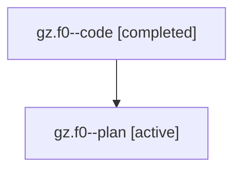

# Family: gz.f0

Owner: `bbugyi200.athena` · Hood: `gz` · Members: 2

## Lineage

The diagram is an optional enhancement; the ordered table below contains the same lineage in accessible text.

| Role | Agent | State | Model / provider | Timing | Commits | Prompt | Chat |
|---|---|---|---|---|---:|---|---|
| code | gz.f0--code | completed | gpt-5.6-sol / codex | 2026-07-21T14:54:42.936618+00:00 | 1 | — | [Chat](../agents/bbugyi200.athena.gz.f0--code/chat.md) |
| plan | gz.f0--plan | active | gpt-5.6-sol / codex | 2026-07-21T14:49:43.013894+00:00 | 0 | [Prompt](../agents/bbugyi200.athena.gz.f0--plan/prompt.md) | [Chat](../agents/bbugyi200.athena.gz.f0--plan/chat.md) |
