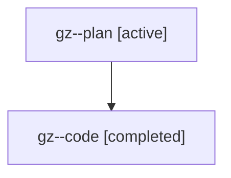

# Family: gz

[Agent Hoods](../README.md) / [bbugyi200](../users/bbugyi200/README.md) / [athena](../users/bbugyi200/machines/athena/README.md) / [gz](../users/bbugyi200/machines/athena/hoods/gz/README.md) / gz

Owner: `bbugyi200.athena` · Hood: `gz` · Members: 2

## Lineage

The diagram is an optional enhancement; the ordered table below contains the same lineage in accessible text.

| Role | Agent | State | Model / provider | Timing | Commits | Prompt | Chat |
|---|---|---|---|---|---:|---|---|
| plan | gz--plan | active | gpt-5.6-sol / codex | 2026-07-21T12:43:45.784873+00:00 | 0 | [Prompt](../agents/bbugyi200.athena.gz--plan/prompt.md) | [Chat](../agents/bbugyi200.athena.gz--plan/chat.md) |
| code | gz--code | completed | gpt-5.6-sol / codex | 2026-07-21T12:53:35.914760+00:00 | [1](../agents/bbugyi200.athena.gz--code/README.md#commits) | — | [Chat](../agents/bbugyi200.athena.gz--code/chat.md) |

## Commits

| Role | Repo | Commit | Subject | Committed |
|---|---|---|---|---|
| code | sase | [`8e7851e`](https://github.com/sase-org/sase/commit/8e7851edeb78730fceabd9adfe2ee0b9d1f56ee3) | feat: add clickable SDD frontmatter links | 2026-07-21 13:24:09 UTC |

## Neighbors

| Agent | Relation | State |
|---|---|---|
| [gz.f0](bbugyi200.athena.gz.f0.md) (family · 2) | descendant | active 1, completed 1 |
