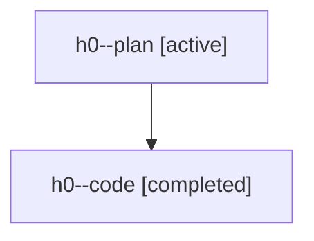

# Family: h0

[Agent Hoods](../README.md) / [bbugyi200](../users/bbugyi200/README.md) / [athena](../users/bbugyi200/machines/athena/README.md) / [h0](../users/bbugyi200/machines/athena/hoods/h0/README.md) / h0

Owner: `bbugyi200.athena` · Hood: `h0` · Members: 2

## Lineage

The diagram is an optional enhancement; the ordered table below contains the same lineage in accessible text.

| Role | Agent | State | Model / provider | Timing | Commits | Prompt | Chat |
|---|---|---|---|---|---:|---|---|
| plan | h0--plan | active | gpt-5.6-sol / codex | 2026-07-21T13:14:04.187025+00:00 | 0 | [Prompt](../agents/bbugyi200.athena.h0--plan/prompt.md) | [Chat](../agents/bbugyi200.athena.h0--plan/chat.md) |
| code | h0--code | completed | gpt-5.6-sol / codex | 2026-07-21T13:19:53.095530+00:00 | [1](../agents/bbugyi200.athena.h0--code/README.md#commits) | — | [Chat](../agents/bbugyi200.athena.h0--code/chat.md) |

## Commits

| Role | Repo | Commit | Subject | Committed |
|---|---|---|---|---|
| code | sase | [`e2ba793`](https://github.com/sase-org/sase/commit/e2ba79309adfa14722851c93c13c29c8c468be83) | perf: reuse fresh roots for update previews | 2026-07-21 13:30:38 UTC |
