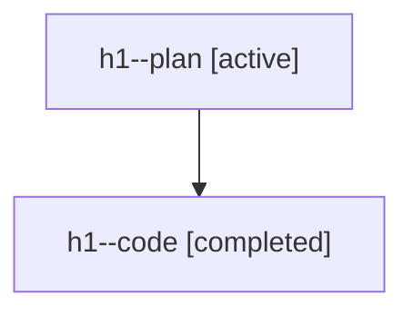

# Family: h1

[Agent Hoods](../README.md) / [bbugyi200](../users/bbugyi200/README.md) / [athena](../users/bbugyi200/machines/athena/README.md) / [h1](../users/bbugyi200/machines/athena/hoods/h1/README.md) / h1

Owner: `bbugyi200.athena` · Hood: `h1` · Members: 2

## Lineage

The diagram is an optional enhancement; the ordered table below contains the same lineage in accessible text.

| Role | Agent | State | Model / provider | Timing | Commits | Prompt | Chat |
|---|---|---|---|---|---:|---|---|
| plan | h1--plan | active | gpt-5.6-sol / codex | 2026-07-21T13:17:02.390832+00:00 | 0 | [Prompt](../agents/bbugyi200.athena.h1--plan/prompt.md) | [Chat](../agents/bbugyi200.athena.h1--plan/chat.md) |
| code | h1--code | completed | gpt-5.6-sol / codex | 2026-07-21T13:23:34.133301+00:00 | [1](../agents/bbugyi200.athena.h1--code/README.md#commits) | — | [Chat](../agents/bbugyi200.athena.h1--code/chat.md) |

## Commits

| Role | Repo | Commit | Subject | Committed |
|---|---|---|---|---|
| code | sase | [`ff8af79`](https://github.com/sase-org/sase/commit/ff8af79b91e305d55e89f2f98d6c70d64e75f048) | feat(ace): warn on custom builtin alias shadows | 2026-07-21 13:36:55 UTC |
