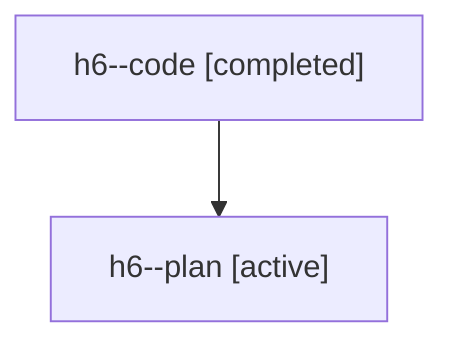

# Family: h6

[Agent Hoods](../README.md) / [bbugyi200](../users/bbugyi200/README.md) / [athena](../users/bbugyi200/machines/athena/README.md) / [h6](../users/bbugyi200/machines/athena/hoods/h6/README.md) / h6

Owner: `bbugyi200.athena` · Hood: `h6` · Members: 2

## Lineage

The diagram is an optional enhancement; the ordered table below contains the same lineage in accessible text.

| Role | Agent | State | Model / provider | Timing | Commits | Prompt | Chat |
|---|---|---|---|---|---:|---|---|
| code | h6--code | completed | gpt-5.6-sol / codex | 2026-07-21T15:11:02.381058+00:00 | 0 | — | [Chat](../agents/bbugyi200.athena.h6--code/chat.md) |
| plan | h6--plan | active | gpt-5.6-sol / codex | 2026-07-21T15:01:14.684410+00:00 | 0 | [Prompt](../agents/bbugyi200.athena.h6--plan/prompt.md) | [Chat](../agents/bbugyi200.athena.h6--plan/chat.md) |
