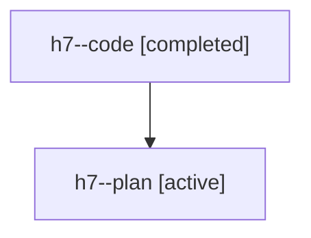

# Family: h7

[Agent Hoods](../README.md) / [bbugyi200](../users/bbugyi200/README.md) / [athena](../users/bbugyi200/machines/athena/README.md) / [h7](../users/bbugyi200/machines/athena/hoods/h7/README.md) / h7

Owner: `bbugyi200.athena` · Hood: `h7` · Members: 2

## Lineage

The diagram is an optional enhancement; the ordered table below contains the same lineage in accessible text.

| Role | Agent | State | Model / provider | Timing | Commits | Prompt | Chat |
|---|---|---|---|---|---:|---|---|
| code | h7--code | completed | gpt-5.6-sol / codex | 2026-07-21T15:11:20.525487+00:00 | [1](../agents/bbugyi200.athena.h7--code/README.md#commits) | — | [Chat](../agents/bbugyi200.athena.h7--code/chat.md) |
| plan | h7--plan | active | gpt-5.6-sol / codex | 2026-07-21T15:04:08.629400+00:00 | 0 | [Prompt](../agents/bbugyi200.athena.h7--plan/prompt.md) | [Chat](../agents/bbugyi200.athena.h7--plan/chat.md) |

## Commits

| Role | Commit | Subject | Committed (UTC) |
|---|---|---|---|
| code | [`26c9b5b`](https://github.com/sase-org/sase/commit/26c9b5bd6ea096906addd24439befa745be21047) | feat: preview commits for comprehensive updates | 2026-07-21 15:54:45 |
