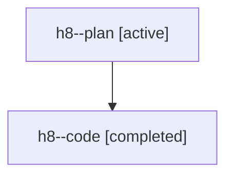

# Family: h8

[Agent Hoods](../README.md) / [bbugyi200](../users/bbugyi200/README.md) / [athena](../users/bbugyi200/machines/athena/README.md) / [h8](../users/bbugyi200/machines/athena/hoods/h8/README.md) / h8

Owner: `bbugyi200.athena` · Hood: `h8` · Members: 2

## Lineage

The diagram is an optional enhancement; the ordered table below contains the same lineage in accessible text.

| Role | Agent | State | Model / provider | Timing | Commits | Prompt | Chat |
|---|---|---|---|---|---:|---|---|
| plan | h8--plan | active | gpt-5.6-sol / codex | 2026-07-21T15:33:15.522830+00:00 | 0 | [Prompt](../agents/bbugyi200.athena.h8--plan/prompt.md) | [Chat](../agents/bbugyi200.athena.h8--plan/chat.md) |
| code | h8--code | completed | gpt-5.6-sol / codex | 2026-07-21T15:38:07.091020+00:00 | [1](../agents/bbugyi200.athena.h8--code/README.md#commits) | — | [Chat](../agents/bbugyi200.athena.h8--code/chat.md) |

## Commits

| Role | Commit | Subject | Committed (UTC) |
|---|---|---|---|
| code | [`d27422f`](https://github.com/sase-org/sase/commit/d27422fd7e8007c5b3073f4ce9bc0d083d17b571) | fix(tui): flag missing agent wait targets | 2026-07-21 16:06:25 |
