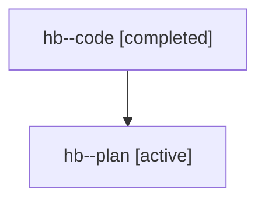

# Family: hb

[Agent Hoods](../README.md) / [bbugyi200](../users/bbugyi200/README.md) / [athena](../users/bbugyi200/machines/athena/README.md) / [hb](../users/bbugyi200/machines/athena/hoods/hb/README.md) / hb

Owner: `bbugyi200.athena` · Hood: `hb` · Members: 2

## Lineage

The diagram is an optional enhancement; the ordered table below contains the same lineage in accessible text.

| Role | Agent | State | Model / provider | Timing | Commits | Prompt | Chat |
|---|---|---|---|---|---:|---|---|
| code | hb--code | completed | gpt-5.6-sol / codex | 2026-07-21T17:06:54.259809+00:00 | 0 | — | [Chat](../agents/bbugyi200.athena.hb--code/chat.md) |
| plan | hb--plan | active | gpt-5.6-sol / codex | 2026-07-21T17:00:22.299481+00:00 | 0 | [Prompt](../agents/bbugyi200.athena.hb--plan/prompt.md) | [Chat](../agents/bbugyi200.athena.hb--plan/chat.md) |
