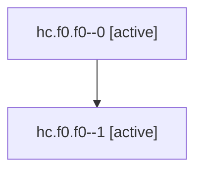

# Family: hc.f0.f0

Owner: `bbugyi200.athena` · Hood: `hc` · Members: 2

## Lineage

The diagram is an optional enhancement; the ordered table below contains the same lineage in accessible text.

| Role | Agent | State | Model / provider | Timing | Commits | Prompt | Chat |
|---|---|---|---|---|---:|---|---|
| 0 | hc.f0.f0--0 | active | gpt-5.6-sol / codex | 2026-07-21T19:59:41.565941+00:00 | 0 | [Prompt](../agents/bbugyi200.athena.hc.f0.f0--0/prompt.md) | [Chat](../agents/bbugyi200.athena.hc.f0.f0--0/chat.md) |
| 1 | hc.f0.f0--1 | active | gpt-5.6-sol / codex | 2026-07-21T20:05:07.820905+00:00 | 0 | — | — |
