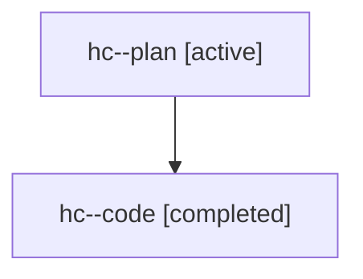

# Family: hc

[Agent Hoods](../README.md) / [bbugyi200](../users/bbugyi200/README.md) / [athena](../users/bbugyi200/machines/athena/README.md) / [hc](../users/bbugyi200/machines/athena/hoods/hc/README.md) / hc

Owner: `bbugyi200.athena` · Hood: `hc` · Members: 2

## Lineage

The diagram is an optional enhancement; the ordered table below contains the same lineage in accessible text.

| Role | Agent | State | Model / provider | Timing | Commits | Prompt | Chat |
|---|---|---|---|---|---:|---|---|
| plan | hc--plan | active | gpt-5.6-sol / codex | 2026-07-21T17:06:40.448647+00:00 | 0 | [Prompt](../agents/bbugyi200.athena.hc--plan/prompt.md) | [Chat](../agents/bbugyi200.athena.hc--plan/chat.md) |
| code | hc--code | completed | gpt-5.6-sol / codex | 2026-07-21T17:22:42.813190+00:00 | [1](../agents/bbugyi200.athena.hc--code/README.md#commits) | — | [Chat](../agents/bbugyi200.athena.hc--code/chat.md) |

## Commits

| Role | Repo | Commit | Subject | Committed (UTC) |
|---|---|---|---|---|
| code | sase | [`7900eeb`](https://github.com/sase-org/sase/commit/7900eeb50a3542af97a6ed0404ff2bb3e45d23f0) | feat(ace): jump to parent agent containers | 2026-07-21 17:41:14 |

## Neighbors

| Agent | Relation | State |
|---|---|---|
| [hc.f0](bbugyi200.athena.hc.f0.md) (family · 2) | descendant | active 1, completed 1 |
| [hc.f0](../agents/bbugyi200.athena.hc.f0/README.md) | descendant | completed |
| [hc.f0.f0](bbugyi200.athena.hc.f0.f0.md) (family · 2) | descendant | active 2 |
