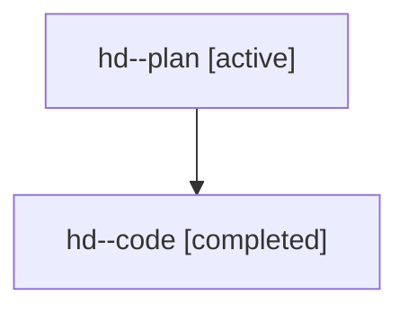

# Family: hd

[Agent Hoods](../README.md) / [bbugyi200](../users/bbugyi200/README.md) / [athena](../users/bbugyi200/machines/athena/README.md) / [hd](../users/bbugyi200/machines/athena/hoods/hd/README.md) / hd

Owner: `bbugyi200.athena` · Hood: `hd` · Members: 2

## Lineage

The diagram is an optional enhancement; the ordered table below contains the same lineage in accessible text.

| Role | Agent | State | Model / provider | Timing | Commits | Prompt | Chat |
|---|---|---|---|---|---:|---|---|
| plan | hd--plan | active | gpt-5.6-sol / codex | 2026-07-21T19:02:57.253176+00:00 | 0 | [Prompt](../agents/bbugyi200.athena.hd--plan/prompt.md) | [Chat](../agents/bbugyi200.athena.hd--plan/chat.md) |
| code | hd--code | completed | gpt-5.6-sol / codex | 2026-07-21T19:10:09.239004+00:00 | [1](../agents/bbugyi200.athena.hd--code/README.md#commits) | — | [Chat](../agents/bbugyi200.athena.hd--code/chat.md) |

## Commits

| Role | Repo | Commit | Subject | Committed |
|---|---|---|---|---|
| code | sase | [`01b06e3`](https://github.com/sase-org/sase/commit/01b06e3d6507c68b3ae9a1ccebc6859a13e40c66) | fix(tui): keep artifact selection in viewport | 2026-07-21 19:22:12 UTC |
