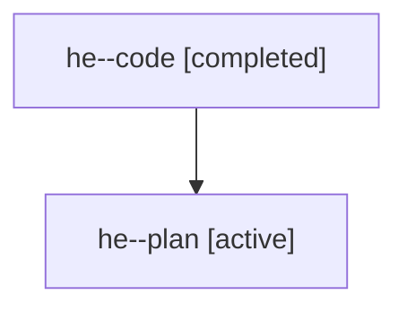

# Family: he

[Agent Hoods](../README.md) / [bbugyi200](../users/bbugyi200/README.md) / [athena](../users/bbugyi200/machines/athena/README.md) / [he](../users/bbugyi200/machines/athena/hoods/he/README.md) / he

Owner: `bbugyi200.athena` · Hood: `he` · Members: 2

## Lineage

The diagram is an optional enhancement; the ordered table below contains the same lineage in accessible text.

| Role | Agent | State | Model / provider | Timing | Commits | Prompt | Chat |
|---|---|---|---|---|---:|---|---|
| code | he--code | completed | gpt-5.6-sol / codex | 2026-07-21T19:16:21.411325+00:00 | 0 | — | [Chat](../agents/bbugyi200.athena.he--code/chat.md) |
| plan | he--plan | active | gpt-5.6-sol / codex | 2026-07-21T19:06:51.347460+00:00 | 0 | [Prompt](../agents/bbugyi200.athena.he--plan/prompt.md) | [Chat](../agents/bbugyi200.athena.he--plan/chat.md) |

## Commits

| Role | Repo | Commit | Subject | Committed |
|---|---|---|---|---|
| — | sase | [`1fe0afe`](https://github.com/sase-org/sase/commit/1fe0afee6009fa5af8eccd3ddf278bdecae8b582) | feat(ace): show commit timeline position badge | 2026-07-21 19:39:28 UTC |
