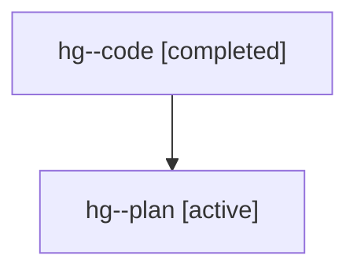

# Family: hg

[Agent Hoods](../README.md) / [bbugyi200](../users/bbugyi200/README.md) / [athena](../users/bbugyi200/machines/athena/README.md) / [hg](../users/bbugyi200/machines/athena/hoods/hg/README.md) / hg

Owner: `bbugyi200.athena` · Hood: `hg` · Members: 2

## Lineage

The diagram is an optional enhancement; the ordered table below contains the same lineage in accessible text.

| Role | Agent | State | Model / provider | Timing | Commits | Prompt | Chat |
|---|---|---|---|---|---:|---|---|
| code | hg--code | completed | gpt-5.6-sol / codex | 2026-07-21T20:07:17.284060+00:00 | [1](../agents/bbugyi200.athena.hg--code/README.md#commits) | — | [Chat](../agents/bbugyi200.athena.hg--code/chat.md) |
| plan | hg--plan | active | gpt-5.6-sol / codex | 2026-07-21T19:59:05.762404+00:00 | 0 | [Prompt](../agents/bbugyi200.athena.hg--plan/prompt.md) | [Chat](../agents/bbugyi200.athena.hg--plan/chat.md) |

## Commits

| Role | Commit | Subject | Committed (UTC) |
|---|---|---|---|
| code | [`99d29be`](https://github.com/sase-org/sase/commit/99d29be7594c410d8f9c8025c52b3da2ff4f69ef) | feat(vim): support visual surround selections | 2026-07-21 20:19:47 |
