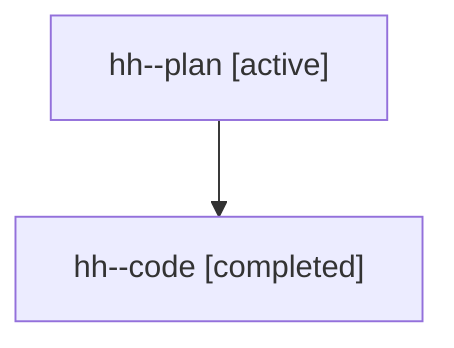

# Family: hh

[Agent Hoods](../README.md) / [bbugyi200](../users/bbugyi200/README.md) / [athena](../users/bbugyi200/machines/athena/README.md) / [hh](../users/bbugyi200/machines/athena/hoods/hh/README.md) / hh

Owner: `bbugyi200.athena` · Hood: `hh` · Members: 2

## Lineage

The diagram is an optional enhancement; the ordered table below contains the same lineage in accessible text.

| Role | Agent | State | Model / provider | Timing | Commits | Prompt | Chat |
|---|---|---|---|---|---:|---|---|
| plan | hh--plan | active | gpt-5.6-sol / codex | 2026-07-21T20:09:12.888861+00:00 | 0 | [Prompt](../agents/bbugyi200.athena.hh--plan/prompt.md) | [Chat](../agents/bbugyi200.athena.hh--plan/chat.md) |
| code | hh--code | completed | gpt-5.6-sol / codex | 2026-07-21T20:14:21.456327+00:00 | [1](../agents/bbugyi200.athena.hh--code/README.md#commits) | — | [Chat](../agents/bbugyi200.athena.hh--code/chat.md) |

## Commits

| Role | Commit | Subject | Committed (UTC) |
|---|---|---|---|
| code | [`4d09e81`](https://github.com/sase-org/sase/commit/4d09e81b9c6669c4ca04594e8fc26dbaf057e080) | fix(ace): show bare container names for family roots | 2026-07-21 20:40:38 |
